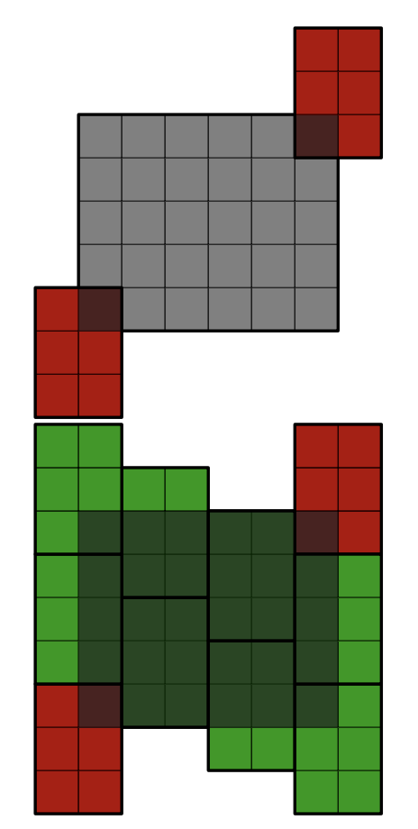
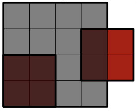

# B. Good Start

## Problem Statement

You are given a rectangular roof of size `w × h` with the bottom left corner at (0, 0). You need to completely cover this roof with identical roofing sheets of size `a × b`, with the following conditions:

- The sheets cannot be rotated (not even by 90 degrees).
- The sheets must not overlap (but they can touch at the edges).
- The sheets can extend beyond the boundaries of the rectangular roof.

Two such sheets have already been placed on the roof, with their bottom left corners at `(x1, y1)` and `(x2, y2)`. These sheets do not overlap and each partially covers the roof.

Your task is to determine whether it is possible to completely tile the roof without removing either of the two already placed sheets.

## Input Format

- The first line contains the number of test cases `t` (1 ≤ t ≤ 10^4).
- For each test case:
  - The first line contains four integers `w`, `h`, `a`, and `b` (1 ≤ w, h, a, b ≤ 10^9) — the dimensions of the roof and the dimensions of the roofing sheets.
  - The second line contains four integers `x1`, `y1`, `x2`, and `y2` (−a+1 ≤ x1, x2 ≤ w−1, −b+1 ≤ y1, y2 ≤ h−1) — the coordinates of the bottom left corners of the already placed sheets.

It is guaranteed that these sheets do not overlap.

## Output Format

For each test case, output "Yes" if it is possible to completely tile the roof without removing either of the two already placed tiles, and "No" otherwise.

You can output the answer in any case (upper or lower).

## Examples

### Input
7  
6 5 2 3  
-1 -2 5 4  
4 4 2 2  
0 0 3 1  
10 9 3 2  
0 0 4 3  
10 9 3 2  
0 0 6 3  
5 5 2 2  
-1 -1 4 -1  
5 5 2 2  
-1 -1 2 3  
7 8 2 4  
0 0 0 5  

### Output
Yes  
No  
No  
Yes  
No  
Yes  
No  

## Explanation

- In the first test case, it is possible to add 8 roofing sheets to completely cover the roof (see the illustration).

- In the second test case, it is impossible to completely tile the roof (see the illustration).

