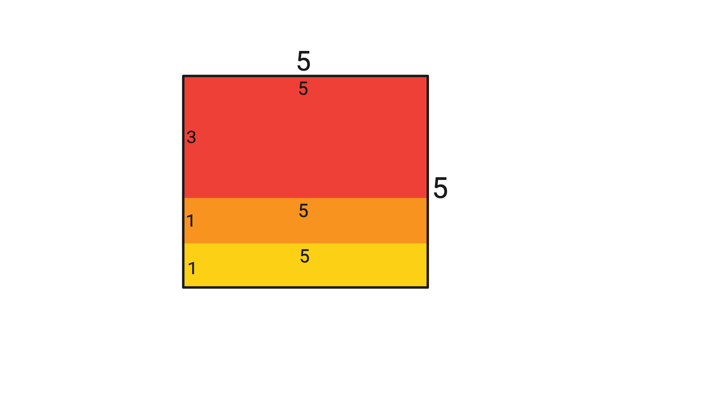

# Problem: A. Square of Rectangles

## Problem Description

Aryan is an ardent lover of squares but a hater of rectangles (Yes, he knows all squares are rectangles). But Harshith likes to mess with Aryan. Harshith gives Aryan three rectangles of sizes `l1 × b1`, `l2 × b2`, and `l3 × b3` such that `l3 ≤ l2 ≤ l1` and `b3 ≤ b2 ≤ b1`. Aryan, in order to defeat Harshith, decides to arrange these three rectangles to form a square such that no two rectangles overlap and the rectangles are aligned along edges. **Rotating rectangles is not allowed.** Help Aryan determine if he can defeat Harshith.

## Input Format

- The first line contains the number of test cases `t` (1 ≤ t ≤ 100).
- Each test case contains a single line with 6 space-separated integers `l1, b1, l2, b2, l3, b3` (1 ≤ l3 ≤ l2 ≤ l1 ≤ 100, 1 ≤ b3 ≤ b2 ≤ b1 ≤ 100) — the dimensions of the three rectangles.

## Output Format

- For each testcase, print "YES" if the rectangles can be arranged to form a square; otherwise, "NO".
- You can output the answer in any case (upper or lower). For example, the strings "yEs", "yes", "Yes", and "YES" will be recognized as positive responses.

## Examples

### Input
5 
100 100 10 10 1 1 
5 3 5 1 5 1 
2 3 1 2 1 1 
8 5 3 5 3 3 
3 3 3 3 2 1 

### Output
NO 
YES 
YES 
NO 
NO 

## Notes

- In the second test case, the three rectangles 5×3, 5×1, and 5×1 can be arranged as follows to form a square.

- In the fourth test case, it can be proven that the rectangles can't be arranged to form a square with the given constraints.