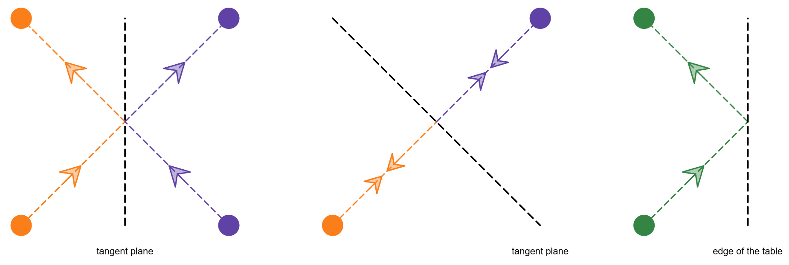

# Problem: B. Square Pool

## Problem Description

Aryan and Harshith are playing pool in universe AX120 on a fixed square pool table of side `s` with **pockets** at its 4 corners. The corners are situated at (0, 0), (0, s), (s, 0), and (s, s). In this game variation, `n` identical balls are placed on the table with integral coordinates such that no ball lies on the edge or corner of the table. Then, they are all simultaneously shot at 10¹⁰⁰ units/sec speed (only at 45 degrees with the axes).

In universe AX120, balls and pockets are almost point-sized, and the collisions are elastic, i.e., the ball, on hitting any surface, bounces off at the same angle and with the same speed.

Harshith shot the balls, and he provided Aryan with the balls' positions and the angles at which he shot them. Help Aryan determine the number of balls potted into the **pockets** by Harshith.

It is guaranteed that multiple collisions do not occur at the same moment and position.

## Input Format

- The first line contains the number of test cases `t` (1 ≤ t ≤ 1000).
- For each test case:
  - The first line contains two integers `n` and `s` (1 ≤ n ≤ 10³, 2 ≤ s ≤ 10⁹) — the number of balls placed on the table and the side length of the square pool table.
  - The next `n` lines each contain four integers `dx`, `dy`, `xi`, and `yi`:
    - `dx`, `dy` ∈ {−1, 1}: the direction vectors of the launch on the X-axis and Y-axis respectively.
    - `xi`, `yi` (0 < xi, yi < s): the coordinates of the location where the i-th ball was placed.
  - It is guaranteed that no two balls coincide at the initial moment.
- It is also guaranteed that the sum of `n` over all test cases does not exceed 10³.

## Output Format

- For each test case, print a single integer — the number of balls potted in that game.

## Examples

### Input
2 
1 2 
1 1 1 1 
5 4 
1 -1 1 1 
1 -1 2 2 
-1 1 2 3 
1 -1 1 3 
-1 1 3 1 

### Output
1 
3 

## Notes

- In the first test case, there is a single ball and it's shot directly towards the pocket at (2, 2), thus potted.

- In the second test case, the state progresses as shown in the diagrams (not included here), with balls bouncing off the sides and some eventually reaching the pockets.