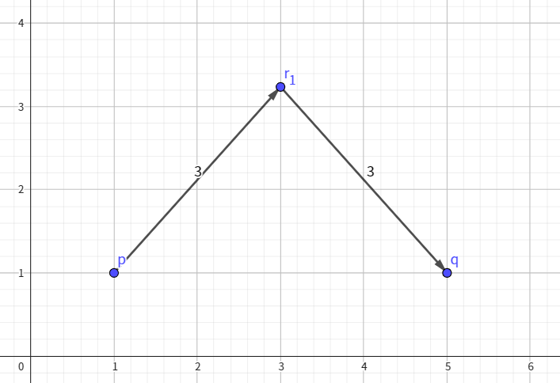
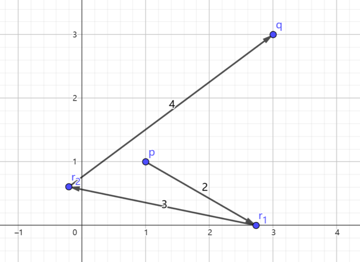

# Problem: B. Line Segments

## Problem Description
You are given two points `(px, py)` and `(qx, qy)` on a Euclidean plane. You start at the starting point `(px, py)` and will perform **n operations**. In the `i`-th operation, you must choose any point such that the **Euclidean distance** between your current position and the point is exactly `a_i`, and then move to that point.

Determine whether it is **possible to reach the terminal point** `(qx, qy)` after performing all operations.

## Input Format
- The first line contains the number of test cases `t` (**1 ≤ t ≤ 10^4**).
- For each test case:
  - The first line contains a single integer `n` (**1 ≤ n ≤ 10^3**) — the length of the sequence `a`.
  - The second line contains four integers `px`, `py`, `qx`, `qy` (**1 ≤ px, py, qx, qy ≤ 10^7**) — the coordinates of the starting point and terminal point.
  - The third line contains `n` integers `a_1, a_2, ..., a_n` (**1 ≤ a_i ≤ 10^4**) — the distance to move in each operation.
- It is guaranteed that the sum of `n` over all test cases does not exceed **2⋅10^5**.

## Output Format
- For each test case, output `Yes` if it is possible to reach the terminal point `(qx, qy)` after all operations; otherwise, output `No`.
- You can output the answer in any case (for example, `yEs`, `yes`, `Yes`, and `YES` will be recognized as positive responses).

## Examples

### Input
5 
2 
1 1 5 1 
3 3 
3 
1 1 3 3 
2 3 4 
2 
100 100 100 100 
4 5 
1 
5 1 1 4 
5 
2 
10000000 10000000 10000000 10000000 
10000 10000 

### Output
Yes 
Yes 
No 
Yes 
Yes 

## Constraints
- `1 ≤ t ≤ 10^4`
- `1 ≤ n ≤ 10^3`
- `1 ≤ px, py, qx, qy ≤ 10^7`
- `1 ≤ a_i ≤ 10^4`
- The sum of `n` over all test cases does not exceed `2⋅10^5`.

## Notes
- The **Euclidean distance** between `(x1, y1)` and `(x2, y2)` is `sqrt((x1 - x2)^2 + (y1 - y2)^2)`.

- You can choose any direction for each move, as long as the distance is exactly `a_i`.

- It is not necessary to move in a straight line between the start and end points.

