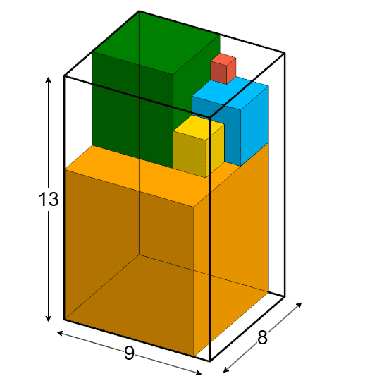

# B. Fibonacci Cubes

## Problem Statement

There are `n` Fibonacci cubes, where the side of the i-th cube is equal to `fi`, the i-th Fibonacci number. The Fibonacci numbers are defined as:
- f1 = 1
- f2 = 2
- fi = fi-1 + fi-2 for i > 2

There are also `m` empty boxes, each with width `wi`, length `li`, and height `hi`.

For each box, determine whether all the cubes can fit inside the box, following these rules:
- The cubes can only be stacked such that their sides are parallel to the sides of the box.
- Every cube must be placed either on the bottom of the box or on top of other cubes so that all space below the cube is occupied.
- A larger cube cannot be placed on top of a smaller cube.

## Input Format

- The first line contains a single integer `t` (1 ≤ t ≤ 1000) — the number of test cases.
- For each test case:
  - The first line contains two integers `n` and `m` (2 ≤ n ≤ 10, 1 ≤ m ≤ 2⋅10^5) — the number of cubes and the number of boxes.
  - The next `m` lines each contain three integers `wi`, `li`, and `hi` (1 ≤ wi, li, hi ≤ 150) — the dimensions of the i-th box.

It is guaranteed that the sum of `m` across all test cases does not exceed 2⋅10^5.

## Output Format

For each test case, output a string of length `m`, where the i-th character is "1" if all `n` cubes can fit into the i-th box, otherwise "0".

## Examples

### Input
2  
5 4  
3 1 2  
10 10 10  
9 8 13  
14 7 20  
2 6  
3 3 3  
1 2 1  
2 1 2  
3 2 2  
2 3 1  
3 2 4  

### Output
0010  
100101  

## Explanation

- In the first test case, only the last box is suitable. The cubes can be placed in it as required.
- In the second test case, the first, fourth, and sixth boxes are suitable for the two cubes.
