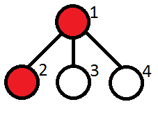
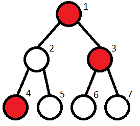

# Problem: Kefa and Park

## Problem Description
Kefa has just received his first big salary and wants to celebrate by visiting a restaurant. He lives near an unusual park, which is structured as a **rooted tree** with `n` vertices, rooted at vertex `1` (Kefa's house). Some vertices contain cats, and Kefa is afraid of encountering too many cats on his way to a restaurant.

The **leaf vertices** of the tree represent restaurants. Kefa will only go to a restaurant if the path from his house (vertex `1`) to the restaurant contains **at most `m` consecutive vertices with cats**. Your task is to determine **how many restaurants Kefa can safely visit**.

## Input Format
- The first line contains two integers: **`n`** (number of vertices in the tree) and **`m`** (maximum allowed consecutive vertices with cats).
- The second line contains `n` integers: **`a1, a2, ..., an`**, where each `ai` is `0` (no cat at vertex `i`) or `1` (cat at vertex `i`).
- The next `n - 1` lines each contain two integers: **`xi yi`**, representing an edge between vertices `xi` and `yi`.

## Output Format
- A single integer: **the number of leaf vertices (restaurants) Kefa can visit** such that the path from his house to the restaurant contains at most `m` consecutive vertices with cats.

## Examples

### Input

4 1 
1 1 0 0 
1 2 
1 3 
1 4 

### Output

2 

### Input

7 1 
1 0 1 1 0 0 0 
1 2 
1 3 
2 4 
2 5 
3 6 
3 7 

### Output

2 

## Constraints
- **2 ≤ n ≤ 105**
- **1 ≤ m ≤ n**
- **1 ≤ xi, yi ≤ n**
- **xi ≠ yi**
- The given edges form a valid tree.

## Notes
- A **tree** is a connected graph with `n` vertices and `n - 1` edges.
- A **rooted tree** has a special vertex called the root. In this problem, vertex `1` is the root.

- A **leaf** is a vertex with no children (i.e., not a parent of any other vertex).

- Kefa cannot visit a restaurant if the path from his house to the restaurant contains more than `m` consecutive vertices with cats.

