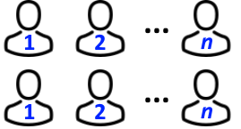
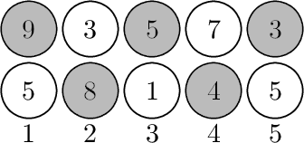
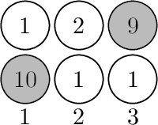

# Problem: Basketball Exercise

## Problem Description
Demid is organizing a basketball exercise session with **2·n students** lined up in two rows of **n students each**. Each student has a certain height. Demid wants to select a team by choosing students from left to right, such that:

- The **index of each chosen player** (except the first) is **strictly greater** than the previous one.
- **No two consecutive chosen students** are from the same row.
- The **first student** can be chosen from any row and any position.
- The team can consist of any number of students.

Demid wants to **maximize the total height** of the chosen team. Help him find the maximum possible total height.

## Input Format
- The first line contains a single integer `n` — the number of students in each row (**1 ≤ n ≤ 10^5**).
- The second line contains `n` integers `h1,1, h1,2, ..., h1,n` (**1 ≤ h1,i ≤ 10^9**) — the heights of students in the first row.
- The third line contains `n` integers `h2,1, h2,2, ..., h2,n` (**1 ≤ h2,i ≤ 10^9**) — the heights of students in the second row.

## Output Format
- Print a single integer — the **maximum possible total height** of players in a team Demid can choose.

## Examples

### Input

5
9 3 5 7 3
5 8 1 4 5
 
### Output

29
 

### Input

3
1 2 9
10 1 1
 
### Output

19
 

### Input

1
7
4
 
### Output

7
 

## Constraints
- `1 ≤ n ≤ 10^5`
- `1 ≤ h1,i, h2,i ≤ 10^9`

## Notes
- The team can start with any student from either row.
- No two consecutive chosen students can be from the same row.
- The order of selection must be strictly increasing in index.
- In the first example Demid can choose the following team as follows: 

- In the second example Demid can choose the following team as follows: 

