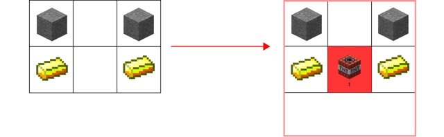
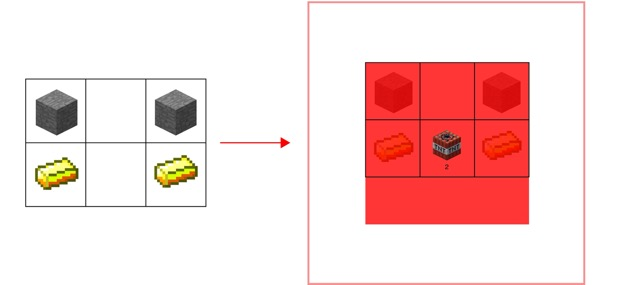
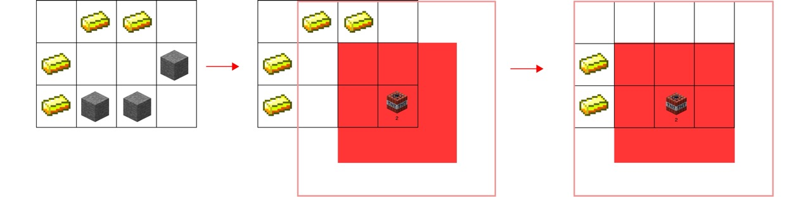

# Problem: C. Smilo and Minecraft

## Problem Description

Smilo is playing Minecraft and needs to collect as much gold as possible from a mine represented as a rectangular grid of size `n × m`. Each cell in the grid can be:
- `.` (an empty cell)
- `#` (stone)
- `g` (gold ore)

Smilo can blow up dynamite in any empty cell. When dynamite explodes in an empty cell at coordinates `(x, y)`, all cells within a square of side `2k + 1` centered at `(x, y)` become empty. If gold ore was **strictly inside** this square (not on the boundary), it disappears. However, if the gold ore was **on the boundary** of this square, Smilo collects that gold.

Dynamite can only be detonated inside the mine, but the explosion square can extend beyond the mine's boundaries.

Determine the **maximum amount of gold** that Smilo can collect.

## Input Format

- The first line contains the number of test cases `t` (1 ≤ t ≤ 10⁴).
- For each test case:
  - The first line contains three integers `n`, `m`, and `k` (1 ≤ n, m, k ≤ 500) — the number of rows, columns, and the explosion parameter.
  - The next `n` lines each contain `m` characters ('.', '#', or 'g'), representing the mine grid.
  - It is guaranteed that at least one of the cells is empty.
  - The sum of `n * m` across all test cases does not exceed 2.5 × 10⁵.

## Output Format

- For each test case, output a single integer — the maximum amount of gold that can be obtained.

## Examples

### Input
3 
2 3 1 
#.# 
g.g 
2 3 2 
#.# 
g.g 
3 4 2 
.gg. 
g..# 
g##. 

### Output
2 
0 
4 

## Notes

- In the first test case, Smilo can detonate the dynamite in any empty cell and obtain 2 gold.

- In the second test case, no matter what Smilo does, he will not be able to obtain any gold.

- In the third test case, it is possible to detonate the dynamite in the bottom right corner to obtain 2 gold, and then make another explosion one cell to the left to obtain the remaining 2 gold.

