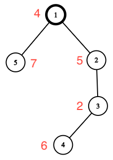

# E. Kirei Attacks the Estate

Once, Kirei stealthily infiltrated the trap-filled estate of the Einzbern family but was discovered by Kiritugu's familiar. Assessing his strength, Kirei decided to retreat. The estate is represented as a tree with n vertices, with the root at vertex 1. Each vertex of the tree has a number aᵢ recorded, which represents the danger of vertex i. Recall that a tree is a connected undirected graph without cycles.

For a successful retreat, Kirei must compute the **threat value** for each vertex. The threat of a vertex is equal to the maximum alternating sum along the vertical path starting from that vertex. The alternating sum along the vertical path starting from vertex i is defined as a₁ − a₂ + a₃ − a₄ + ... , where pⱼ is the parent of vertex j on the path to the root (to vertex 1).

For example, in the tree below, vertex 4 has the following vertical paths:
- [4] with an alternating sum of 4;
- [4, 3] with an alternating sum of 4 − 3 = 1;
- [4, 3, 2] with an alternating sum of 4 − 3 + 2 = 3;
- [4, 3, 2, 1] with an alternating sum of 4 − 3 + 2 − 1 = 2.

Help Kirei compute the threat values for all vertices and escape the estate.

---

## Input

The first line contains an integer t (1 ≤ t ≤ 10⁴) — the number of test cases.

The following describes the test cases.

The first line of each test case contains an integer n (2 ≤ n ≤ 2·10⁵) — the number of vertices in the tree.

The second line contains n integers a₁, a₂, ..., aₙ (1 ≤ aᵢ ≤ 10⁹) — the dangers of the vertices.

The next n − 1 lines contain the numbers v, u (1 ≤ v, u ≤ n, v ≠ u) — the description of the edges of the tree.

It is guaranteed that the sum of n across all test cases does not exceed 2·10⁵. It is also guaranteed that the given set of edges forms a tree.

---

## Output

For each test case, output n integers — the threat of each vertex.

---

## Example

Input

2
5
4 5 2 6 7
1 2
3 2
4 3
5 1
6
1000000000 508505060 908090960 9 404 800800800
3 1
2 3
1 4
5 1
6 4

Output

4 5 2 9 7
1000000000 1508508096 1701701691 199199209 404 800800800

---

## Note

The tree from the first test case is depicted in the statement, and the maximum variable-sign sums are achieved as follows:

1. a₁ = 4;
2. a₂ = 5;
3. a₃ = 2;
4. a₄ = a₄ − a₃ + a₂ = 6 − 2 + 5 = 9;
5. a₅ = 7.

1. Solve in java, Public Class name is Solution
2. No comments in the full code
3. Solve this question full
