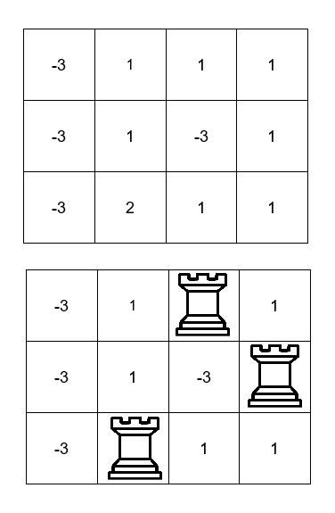

# Problem: Maximum Value Sum by Placing Three Rooks II

## Problem Description

You are given an `m x n` 2D array `board` representing a chessboard, where `board[i][j]` represents the value of the cell `(i, j)`.

Rooks in the same row or column attack each other. You need to place **three rooks** on the chessboard such that the rooks do **not** attack each other (i.e., no two are in the same row or column).

Return the **maximum sum** of the cell values on which the rooks are placed.

## Input Format

- A 2D integer array `board` of size `m x n`.

## Output Format

- An integer representing the maximum sum of the cell values on which the three non-attacking rooks are placed.

## Examples

### Example 1

**Input:**  
board = [[-3,1,1,1],[-3,1,-3,1],[-3,2,1,1]]

**Output:**  
4

**Explanation:**  

We can place the rooks in the cells (0, 2), (1, 3), and (2, 1) for a sum of 1 + 1 + 2 = 4.

### Example 2

**Input:**  
board = [[1,2,3],[4,5,6],[7,8,9]]

**Output:**  
15

**Explanation:**  
We can place the rooks in the cells (0, 0), (1, 1), and (2, 2) for a sum of 1 + 5 + 9 = 15.

### Example 3

**Input:**  
board = [[1,1,1],[1,1,1],[1,1,1]]

**Output:**  
3

**Explanation:**  
We can place the rooks in the cells (0, 2), (1, 1), and (2, 0) for a sum of 1 + 1 + 1 = 3.

## Constraints

- 3 ≤ m == board.length ≤ 500
- 3 ≤ n == board[i].length ≤ 500
- -10^9 ≤ board[i][j] ≤ 10^9
