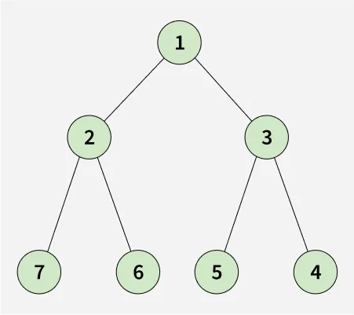
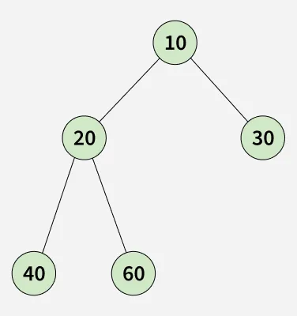

# Level Order in Spiral Form

Given a binary tree, the task is to find the **spiral order traversal** of the tree and return the list containing the elements.

**Spiral order traversal** means:  
- Starting from level 0 (the root node), for all **even levels** print the node's values from **right to left**.
- For all **odd levels**, print the node's values from **left to right**.

---

## Examples

### Example 1

**Input:**  
root = [1, 3, 2]

**Output:**  
[1, 3, 2]

**Explanation:**  
Start with root (1), print level 0 (right to left), then level 1 (left to right).

---

### Example 2

**Input:**  
root = [10, 20, 30, 40, 60]

**Output:**  
[10, 20, 30, 60, 40]

**Explanation:**  
Start with root (10), print level 0 (right to left), level 1 (left to right), and continue alternating.

---

### Example 3

**Input:**  
root = [1, 2, N, 4]

**Output:**  
[1, 2, 4]

**Explanation:**  
Start with root (1), then level 1 (left to right), then level 2 (right to left).

---

## Constraints

- 1 ≤ number of nodes ≤ 10⁵
- 0 ≤ node->data ≤ 10⁵
