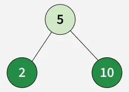
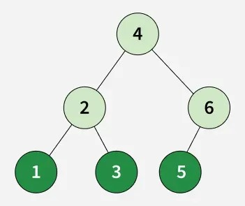
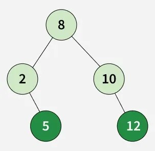

# Print Leaf Nodes from Preorder Traversal of BST

Given a preorder traversal of a BST, find the leaf nodes of the tree **without building the tree**.

---

## Examples

### Example 1

Input: preorder[] = [5, 2, 10]  
Output: [2, 10]  
Explanation:  
2 and 10 are the leaf nodes as shown in the figure.

---

### Example 2

Input: preorder[] = [4, 2, 1, 3, 6, 5]  
Output: [1, 3, 5]  
Explanation:  
1, 3, and 5 are the leaf nodes as shown in the figure.

---

### Example 3

Input: preorder[] = [8, 2, 5, 10, 12]  
Output: [5, 12]  
Explanation:  
5 and 12 are the leaf nodes as shown in the figure.

---

## Constraints

- 1 ≤ preorder.size() ≤ 10^3
- 1 ≤ preorder[i] ≤ 10^3
