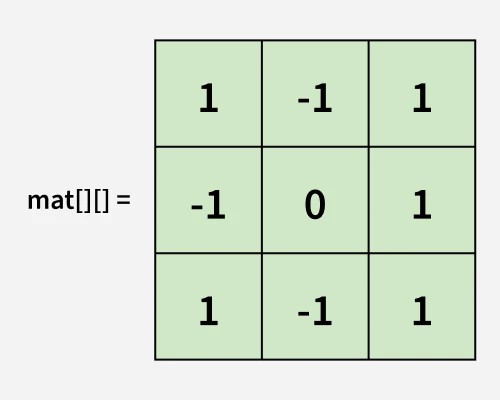
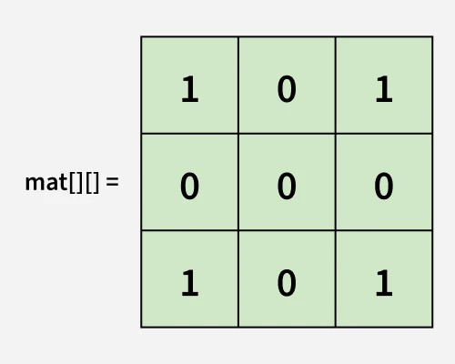
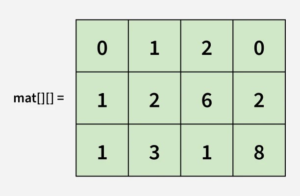
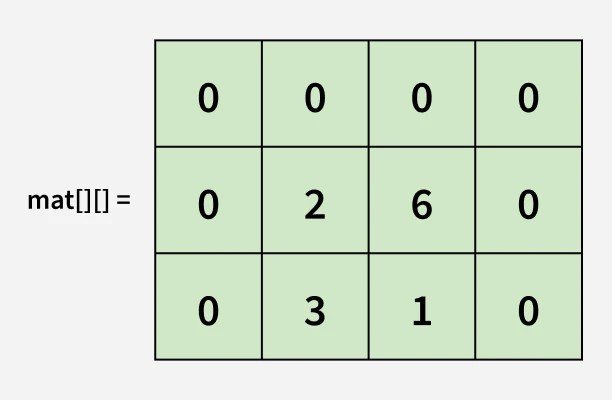

# Problem: Set Matrix Zeros

## Problem Description
You are given a **2D matrix** `mat[][]` of size `n x m`. The task is to **modify the matrix** such that if `mat[i][j]` is `0`, **all the elements in the i-th row and j-th column are set to 0**.

## Input Format
A 2D matrix `mat[][]` of size `n x m`.

## Output Format
The modified matrix where if any element is `0`, the entire row and column containing that element are set to `0`.

## Examples

### Input

`mat[][] = [[1, -1, 1], [1, 0, 1], [1, -1, 1]]` 

### Output

`[[1, 0, 1], [0, 0, 0], [1, 0, 1]]` 

**Explanation:** `mat[1][1] = 0`, so **all elements in row 1 and column 1 are updated to zeroes**.

### Input

`mat[][] = [[0, 1, 2, 0], [3, 4, 5, 2], [1, 3, 1, 5]]` 

### Output

`[[0, 0, 0, 0], [0, 4, 5, 0], [0, 3, 1, 0]]` 

**Explanation:** `mat[0][0]` and `mat[0][3]` are `0`s, so **all elements in row 0, column 0 and column 3 are updated to zeroes**.

## Constraints
- **1 ≤ n, m ≤ 500**
- **-2^31 ≤ mat[i][j] ≤ 2^31 - 1**

