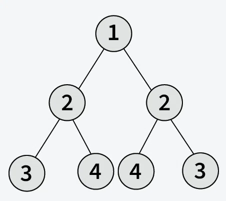

# Symmetric Tree

## Problem Statement

Given the root of a binary tree, check whether it is symmetric, i.e., whether the tree is a mirror image of itself.

A binary tree is symmetric if the left subtree is a mirror reflection of the right subtree.

## Input Format

- The binary tree is given as a list `root[]` representing the level order traversal of the tree, where `N` denotes a null node.

## Output Format

- Output `True` if the tree is symmetric, otherwise output `False`.

## Constraints

- 1 ≤ number of nodes ≤ 2000

## Examples

### Example 1

Input:  

root[] = [1, 2, 2, 3, 4, 4, 3]

Output:  
True

Explanation:  
As the left and right half of the above tree is mirror image, the tree is symmetric.

### Example 2

Input:  

root[] = [1, 2, 2, N, 3, N, 3]

Output:  
False

Explanation:  
As the left and right half of the above tree is not the mirror image, the tree is not symmetric.
