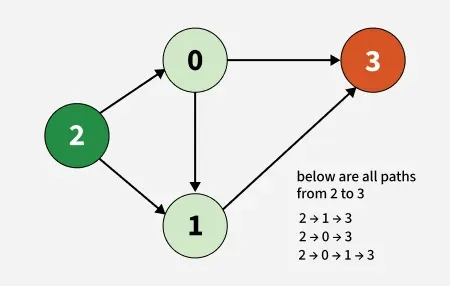
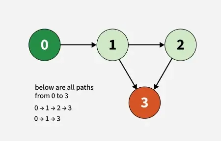

# Count the Paths

## Problem Statement
Given a Directed Acyclic Graph (DAG) with `V` nodes labeled from `0` to `V-1`, and a list of directed edges, count the total number of distinct paths from a given start node to a destination node. Each edge is represented as `edges[i] = [u, v]`, indicating a directed edge from `u` to `v`.

## Input Format
- `edges`: A list of pairs, where each pair `[u, v]` represents a directed edge from node `u` to node `v`.
- `V`: An integer, the number of nodes in the graph.
- `src`: The starting node.
- `dest`: The destination node.

## Output Format
- An integer representing the total number of distinct paths from `src` to `dest`.

## Constraints
- 2 ≤ V ≤ 1000
- 1 ≤ E = edges.size() ≤ (V * (V - 1)) / 2

## Examples

### Example 1
Input:  
edges = [[0,1], [0,3], [2,0], [2,1], [1,3]]  
V = 4  
src = 2  
dest = 3  

Output:  
3  

Explanation:  
There are three ways to reach node 3 from node 2:  
- 2 -> 1 -> 3  
- 2 -> 0 -> 3  
- 2 -> 0 -> 1 -> 3  

### Example 2
Input:  
edges = [[0,1], [1,2], [1,3], [2,3]]  
V = 4  
src = 0  
dest = 3  

Output:  
2  

Explanation:  
There are two ways to reach node 3 from node 0:  
- 0 -> 1 -> 2 -> 3  
- 0 -> 1 -> 3

