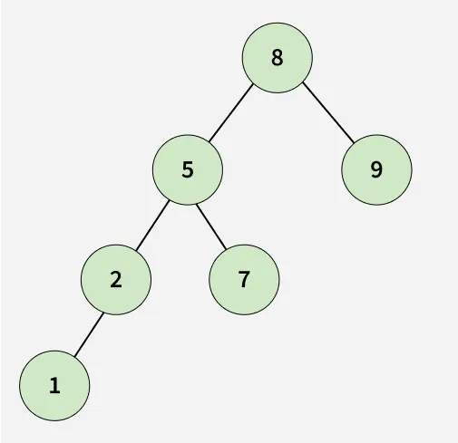
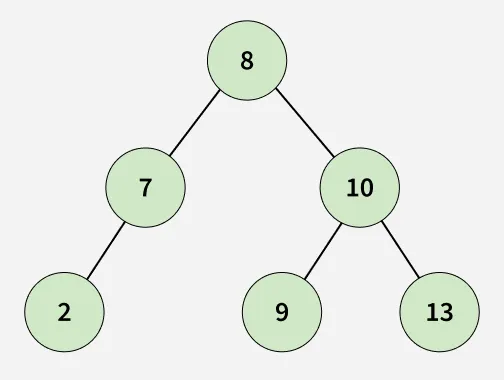

# BST with Dead End

## Problem Statement

You are given a Binary Search Tree (BST) containing unique positive integers greater than 0.

Your task is to determine whether the BST contains a **dead end**.

A **dead end** is a leaf node in the BST such that no new node can be inserted in the BST at or below this node while maintaining the BST property and the constraint that all node values must be > 0.

## Input Format

- The BST is given as a list `root[]` representing the level order traversal of the tree, where `N` denotes a null node.

## Output Format

- Output `true` if the BST contains a dead end, otherwise output `false`.

## Constraints

- 1 ≤ number of nodes ≤ 3000
- 1 ≤ node->data ≤ 10^5

## Examples

### Example 1

Input:  

root[] = [8, 5, 9, 2, 7, N, N, 1]

Output:  
true

Explanation:  
Node 1 is a dead end in the given BST.

### Example 2

Input:  

root[] = [8, 7, 10, 2, N, 9, 13]

Output:  
true

Explanation:  
Node 9 is a dead end in the given BST.
