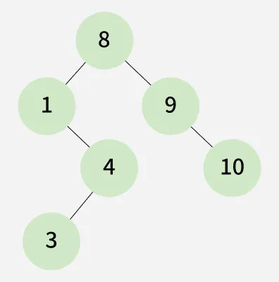
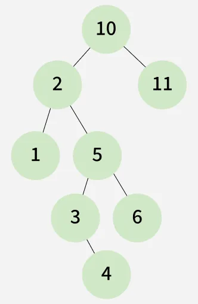

# Predecessor and Successor

Given the root node of a Binary Search Tree (BST) and an integer `key`, find the in-order successor and predecessor of the given key. If either predecessor or successor is not found, then set it to `NULL` (or `-1` in output).

**Note:**  
In an inorder traversal, the number just smaller than the target is the predecessor and the number just greater than the target is the successor.

---

## Examples

### Example 1

**Input:**  
root[] = [8, 1, 9, N, 4, N, 10, 3, N, N, N], key = 8

**Output:**  
4 9

**Explanation:**  
In the given BST, the inorder predecessor of 8 is 4 and the inorder successor of 8 is 9.

---

### Example 2

**Input:**  
root[] = [10, 2, 11, 1, 5, N, N, N, N, 3, 6, N, 4, N, N], key = 11

**Output:**  
10 -1

**Explanation:**  
In the given BST, the inorder predecessor of 11 is 10 whereas it does not have any inorder successor.

---

### Example 3

**Input:**  
root[] = [2, 1, 3], key = 3

**Output:**  
2 -1

**Explanation:**  
In the given BST, the inorder predecessor of 3 is 2 whereas it does not have any inorder successor.

---

## Constraints

- 1 <= no. of nodes <= 10^5
- 1 <= node->data <= 10^6
- 1 <= key <= 10^6
