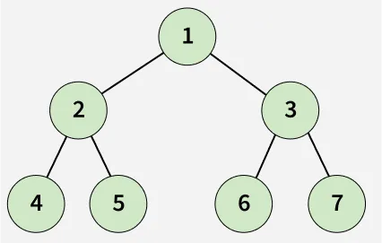

# Burning Tree

Given a binary tree and a target node, determine the minimum time required to burn the entire tree if the target node is set on fire. In one second, the fire spreads from a node to its left child, right child, and parent.

**Note:** The tree contains unique values.

---

## Examples

### Example 1

**Input:**  
root[] = [1, 2, 3, 4, 5, 6, 7], target = 2

**Output:**  
3

**Explanation:**  
Initially 2 is set to fire at 0 sec  
At 1 sec: Nodes 4, 5, 1 catch fire.  
At 2 sec: Node 3 catches fire.  
At 3 sec: Nodes 6, 7 catch fire.  
It takes 3 seconds to burn the complete tree.

---

### Example 2

**Input:**  
root[] = [1, 2, 3, 4, 5, N, 7, 8, N, 10], target = 10

**Output:**  
5

**Explanation:**  
Initially 10 is set to fire at 0 sec  
At 1 sec: Node 5 catches fire.  
At 2 sec: Node 2 catches fire.  
At 3 sec: Nodes 1 and 4 catch fire.  
At 4 sec: Node 3 and 8 catch fire.  
At 5 sec: Node 7 catches fire.  
It takes 5 seconds to burn the complete tree.

---

## Constraints

- 1 ≤ number of nodes ≤ 10^5
- 1 ≤ node->data ≤ 10^5
