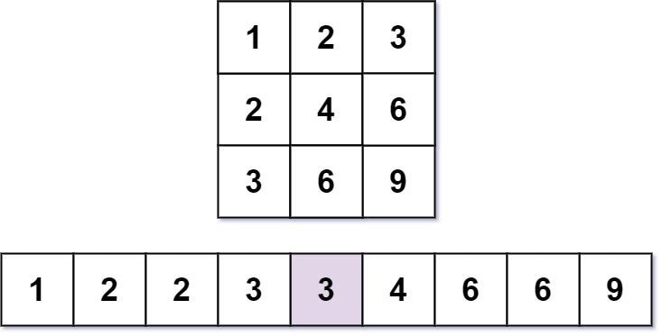

# Kth Smallest Number in Multiplication Table

Given three integers `m`, `n`, and `k`. Consider a grid of size `m * n`, where `mat[i][j] = i * j` (1-based index). The task is to return the `k`th smallest element in the `m * n` multiplication table.

---

## Examples

### Example 1

**Input:**  
m = 3, n = 3, k = 5

**Output:**  
3

**Explanation:**  

The 5th smallest element is 3.

---

### Example 2

**Input:**  
m = 2, n = 3, k = 6

**Output:**  
6

**Explanation:**  
The multiplication table is:  
[1, 2, 3]  
[2, 4, 6]  
The 6th smallest element is 6.

---

## Constraints

- 1 <= m, n <= 3 * 10^4
- 1 <= k <= m * n
