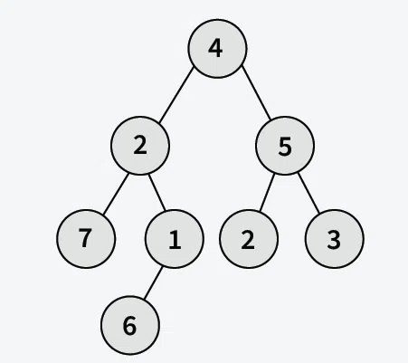
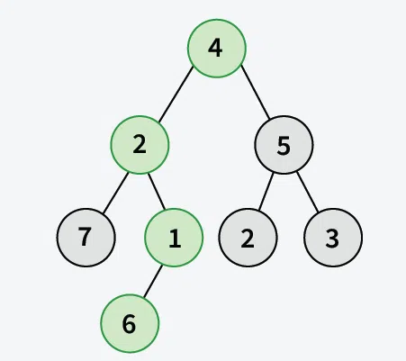
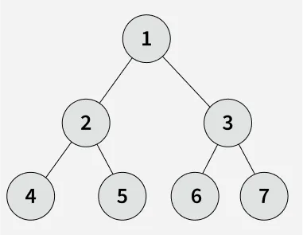
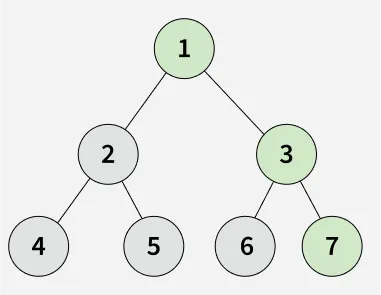
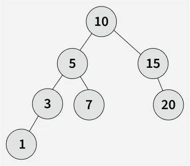
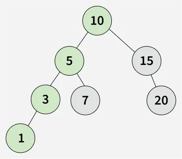

# Sum of Nodes on the Longest Path

Given a binary tree `root[]`, you need to find the sum of the nodes on the longest path from the root to any leaf node. If two or more paths have the same length, the path with the maximum sum of node values should be considered.

---

## Examples

### Example 1

**Input:**  
root[] = [4, 2, 5, 7, 1, 2, 3, N, N, 6, N]

**Output:**  
13

**Explanation:**  
The highlighted nodes (4, 2, 1, 6) above are part of the longest root to leaf path having sum = (4 + 2 + 1 + 6) = 13.

---

### Example 2

**Input:**  
root[] = [1, 2, 3, 4, 5, 6, 7]

**Output:**  
11

**Explanation:**  
The longest root-to-leaf path is 1 -> 3 -> 7, with sum 11.

---

### Example 3

**Input:**  
root[] = [10, 5, 15, 3, 7, N, 20, 1]

**Output:**  
19

**Explanation:**  
The longest root-to-leaf path is 10 -> 5 -> 3 -> 1 with a sum of 10 + 5 + 3 + 1 = 19.

---

## Constraints

- 1 <= number of nodes <= 10^6
- 0 <= node->data <= 10^4
