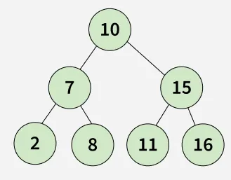
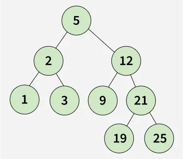

# Closest Neighbour in BST

Given the root of a binary search tree and a number `k`, find the greatest number in the binary search tree that is less than or equal to `k`.

---

## Examples

### Example 1

**Input:**  
root = [10, 7, 15, 2, 8, 11, 16], k = 14

**Output:**  
11

**Explanation:**  
The greatest element in the tree which is less than or equal to 14, is 11.

---

### Example 2

**Input:**  
root = [5, 2, 12, 1, 3, 9, 21, N, N, N, N, N, N, 19, 25], k = 24

**Output:**  
21

**Explanation:**  
The greatest element in the tree which is less than or equal to 24, is 21.

---

### Example 3

**Input:**  
root = [5, 2, 12, 1, 3, 9, 21, N, N, N, N, N, N, 19, 25], k = 4

**Output:**  
3

**Explanation:**  
The greatest element in the tree which is less than or equal to 4, is 3.

---

## Constraints

- 1 <= number of nodes <= 10^5
- 1 <= node->data, k <= 10^5
- All nodes are unique in the BST
