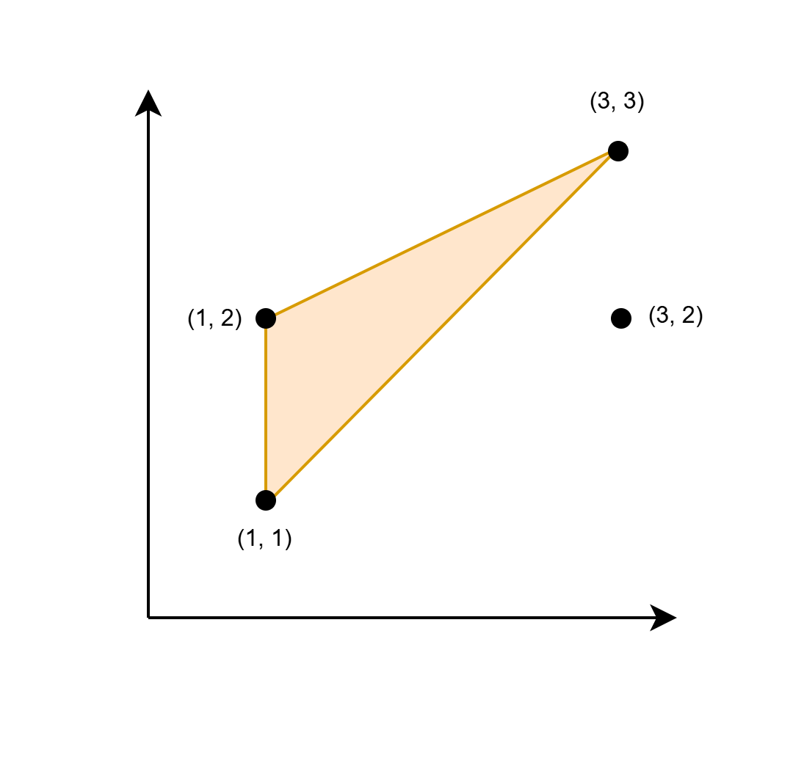

# Problem: Find Maximum Area of a Triangle

## Problem Description

You are given a 2D array `coords` of size n x 2, representing the coordinates of n points in an infinite Cartesian plane.

Find **twice the maximum area** of a triangle with its corners at any three elements from `coords`, such that at least one side of this triangle is parallel to the x-axis or y-axis. Formally, if the maximum area of such a triangle is A, return 2 * A.

If no such triangle exists, return -1.

**Note:** A triangle cannot have zero area.

## Input Format

- An integer matrix `coords` of size n x 2, where each row represents the coordinates [xi, yi] of a point.

## Output Format

- An integer representing twice the maximum area of a valid triangle, or -1 if no such triangle exists.

## Examples

### Example 1

**Input:**  
coords = [[1,1],[1,2],[3,2],[3,3]]

**Output:**  
2

**Explanation:**  
The triangle shown in the image has a base 1 and height 2. Hence its area is 1/2 * base * height = 1.  
Twice the area is 2.

### Example 2

**Input:**  
coords = [[1,1],[2,2],[3,3]]

**Output:**  
-1

**Explanation:**  
The only possible triangle has corners (1, 1), (2, 2), and (3, 3). None of its sides are parallel to the x-axis or the y-axis.

## Constraints

- 1 ≤ n == coords.length ≤ 10^5
- 1 ≤ coords[i][0], coords[i][1] ≤ 10^6
- All coords[i] are unique.