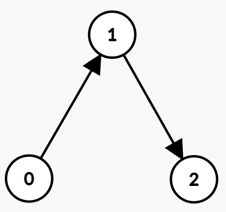
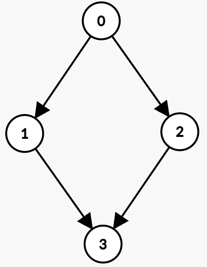

# Minimum Time to Reach Destination in Directed Graph

## Problem Description
You are given an integer `n` and a **directed graph** with `n` nodes labeled from `0` to `n - 1`. The graph is represented by a 2D array `edges`, where `edges[i] = [ui, vi, starti, endi]` indicates an edge from node `ui` to `vi` that can only be used at any integer time `t` such that `starti <= t <= endi`.

You **start at node 0 at time 0**.

In one unit of time, you can either:
- **Wait** at your current node without moving, or
- **Travel** along an outgoing edge from your current node if the current time `t` satisfies `starti <= t <= endi`.

Return the **minimum time required to reach node `n - 1`**. If it is impossible, return `-1`.

## Input Format
- An integer `n`, the number of nodes.
- A 2D array `edges`, where each element is `[ui, vi, starti, endi]`:
  - `ui`: starting node of the edge
  - `vi`: ending node of the edge
  - `starti`: earliest time the edge can be used
  - `endi`: latest time the edge can be used

## Output Format
- An integer representing the **minimum time required to reach node `n - 1`** from node `0`. If it is impossible, output `-1`.

## Examples

### Input
`n = 3`, `edges = [[0,1,0,1],[1,2,2,5]]` 
**Output:** `3` 
**Explanation:**

- At time `t = 0`, take the edge `(0 → 1)` which is available from `0` to `1`. You arrive at node `1` at time `t = 1`, then wait until `t = 2`.
- At time `t = 2`, take the edge `(1 → 2)` which is available from `2` to `5`. You arrive at node `2` at time `3`.
- The minimum time to reach node `2` is `3`.

### Input
`n = 4`, `edges = [[0,1,0,3],[1,3,7,8],[0,2,1,5],[2,3,4,7]]` 
**Output:** `5` 
**Explanation:**

- Wait at node `0` until time `t = 1`, then take the edge `(0 → 2)` which is available from `1` to `5`. You arrive at node `2` at `t = 2`.
- Wait at node `2` until time `t = 4`, then take the edge `(2 → 3)` which is available from `4` to `7`. You arrive at node `3` at `t = 5`.
- The minimum time to reach node `3` is `5`.

### Input
`n = 3`, `edges = [[1,0,1,3],[1,2,3,5]]` 
**Output:** `-1` 
**Explanation:**

- Since there is no outgoing edge from node `0`, it is impossible to reach node `2`. Hence, the output is `-1`.

## Constraints
- `1 <= n <= 10^5`
- `0 <= edges.length <= 10^5`
- `edges[i] == [ui, vi, starti, endi]`
- `0 <= ui, vi <= n - 1`
- `ui != vi`
- `0 <= starti <= endi <= 10^9`

## Notes
- You may **wait at any node for any amount of time**.
- Each edge can only be used within its specified time window.

