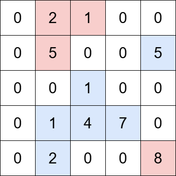
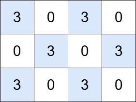

# Problem: Count Islands With Total Value Divisible by K

## Problem Description
You are given an `m x n` matrix `grid` and a positive integer `k`. An **island** is a group of **positive integers** (representing land) that are **4-directionally connected** (horizontally or vertically). The **total value** of an island is the **sum of the values** of all cells in the island.

Your task is to **return the number of islands with a total value divisible by `k`**.

## Input Format
- The first line contains two integers: `m` and `n` — the number of rows and columns in the grid.
- The next `m` lines each contain `n` integers, representing the grid.
- The last line contains a single integer `k` — the divisor.

## Output Format
- Output a single integer: the **number of islands whose total value is divisible by `k`**.

## Examples

### Input

`grid = [[0,2,1,0,0],[0,5,0,0,5],[0,0,1,0,0],[0,1,4,7,0],[0,2,0,0,8]], k = 5` 

### Output
`2` 

**Explanation:**
The grid contains four islands. The islands highlighted in blue have a total value that is divisible by `5`, while the islands highlighted in red do not.

### Input

`grid = [[3,0,3,0], [0,3,0,3], [3,0,3,0]], k = 3` 

### Output
`6` 

**Explanation:**
The grid contains six islands, each with a total value that is divisible by `3`.

## Constraints
- `m == grid.length`
- `n == grid[i].length`
- `1 <= m, n <= 1000`
- `1 <= m * n <= 10^5`
- `0 <= grid[i][j] <= 10^6`
- `1 <= k <= 10^6`

## Notes
- Only **positive integers** in the grid are considered as land; `0` represents water.
- Two land cells are part of the same island if they are **4-directionally connected** (up, down, left, right).
- The total value of an island is the **sum of all its land cell values**.

