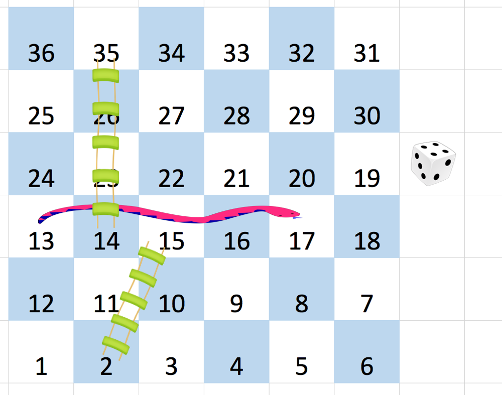

# 909. Snakes and Ladders

You are given an `n x n` integer matrix `board` where the cells are labeled from 1 to n² in a Boustrophedon style starting from the bottom left of the board (i.e. `board[n - 1][0]`) and alternating direction each row.

You start on square 1 of the board. In each move, starting from square `curr`, do the following:

- Choose a destination square `next` with a label in the range `[curr + 1, min(curr + 6, n²)]`.
  - This choice simulates the result of a standard 6-sided die roll: i.e., there are always at most 6 destinations, regardless of the size of the board.
- If `next` has a snake or ladder, you must move to the destination of that snake or ladder. Otherwise, you move to `next`.
- The game ends when you reach the square `n²`.

A board square on row `r` and column `c` has a snake or ladder if `board[r][c] != -1`. The destination of that snake or ladder is `board[r][c]`. Squares 1 and n² are not the starting points of any snake or ladder.

**Note:** You only take a snake or ladder at most once per dice roll. If the destination to a snake or ladder is the start of another snake or ladder, you do not follow the subsequent snake or ladder.

- For example, suppose the board is `[[-1,4],[-1,3]]`, and on the first move, your destination square is 2. You follow the ladder to square 3, but do not follow the subsequent ladder to 4.

Return the least number of dice rolls required to reach the square `n²`. If it is not possible to reach the square, return `-1`.

---

## Examples

### Example 1

**Input:**  
board = [[-1,-1,-1,-1,-1,-1],  
         [-1,-1,-1,-1,-1,-1],  
         [-1,-1,-1,-1,-1,-1],  
         [-1,35,-1,-1,13,-1],  
         [-1,-1,-1,-1,-1,-1],  
         [-1,15,-1,-1,-1,-1]]

**Output:**  
4

**Explanation:**  
- Start at square 1 (row 5, column 0).
- Move to square 2, take the ladder to 15.
- Move to square 17, take the snake to 13.
- Move to square 14, take the ladder to 35.
- Move to square 36, ending the game.
- Minimum moves: 4.

---

### Example 2

**Input:**  
board = [[-1,-1],  
         [-1,3]]

**Output:**  
1

---

## Constraints

- n == board.length == board[i].length
- 2 <= n <= 20
- board[i][j] is either -1 or in the range [1, n²].
- The squares labeled 1 and n² are not the starting points of any snake or ladder.
