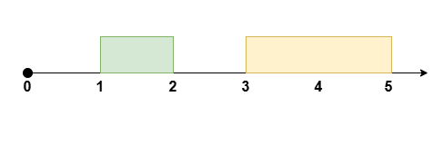
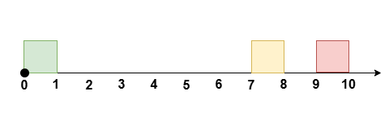
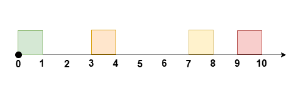

# Problem: Reschedule Meetings for Maximum Free Time II

## Problem Description
You are given an integer `eventTime` representing the total duration of an event. There are `n` non-overlapping meetings, each with a start and end time given by the arrays `startTime` and `endTime` (both of length `n`). The `i`-th meeting occurs during the interval `[startTime[i], endTime[i]]` within the event, where `0 <= startTime[i] < endTime[i] <= eventTime` and `endTime[i] <= startTime[i+1]` for all valid `i`.

You may **reschedule at most one meeting** by moving its start time (while keeping its duration unchanged), as long as:
- The meeting remains within the event time (`[0, eventTime]`)
- Meetings remain non-overlapping
- The relative order of meetings may change after rescheduling

Your goal is to **maximize the longest continuous period of free time** (i.e., time not occupied by any meeting) during the event after rescheduling.

## Input Format
- **eventTime:** An integer representing the total duration of the event
- **startTime:** An array of integers of length `n`, where `startTime[i]` is the start time of the `i`-th meeting
- **endTime:** An array of integers of length `n`, where `endTime[i]` is the end time of the `i`-th meeting

## Output Format
- An integer representing the **maximum possible length of free time** after rescheduling at most one meeting

## Examples

### Input
`eventTime = 5, startTime = [1, 3], endTime = [2, 5]` 

### Output
`2` 

**Explanation:**

Reschedule the meeting at `[1, 2]` to `[2, 3]`, leaving no meetings during the time `[0, 2]`.

### Input
`eventTime = 10, startTime = [0, 7, 9], endTime = [1, 8, 10]` 

### Output
`7` 

**Explanation:**

Reschedule the meeting at `[0, 1]` to `[8, 9]`, leaving no meetings during the time `[0, 7]`.

### Input
`eventTime = 10, startTime = [0, 3, 7, 9], endTime = [1, 4, 8, 10]` 

### Output
`6` 

**Explanation:**

Reschedule the meeting at `[3, 4]` to `[8, 9]`, leaving no meetings during the time `[1, 7]`.

### Input
`eventTime = 5, startTime = [0, 1, 2, 3, 4], endTime = [1, 2, 3, 4, 5]` 

### Output
`0` 

**Explanation:**
There is no time during the event not occupied by meetings.

## Constraints
- **1 <= eventTime <= 10^9**
- **n == startTime.length == endTime.length**
- **2 <= n <= 10^5**
- **0 <= startTime[i] < endTime[i] <= eventTime**
- **endTime[i] <= startTime[i + 1]** for all valid `i` in `[0, n - 2]`

## Notes
- You may only reschedule **one** meeting.
- Meetings must remain non-overlapping and within the event time after rescheduling.
- The relative order of meetings may change after rescheduling.

