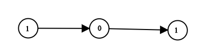

# Problem: Convert Binary Number in a Linked List to Integer

## Problem Description
Given `head`, a reference node to a singly-linked list where each node contains a value of either `0` or `1`, the linked list represents a **binary number**. The most significant bit is at the head of the linked list. Your task is to **return the decimal value** of the number represented by the linked list.

## Input Format
- The input consists of a singly-linked list referenced by `head`.
- Each node contains a value of either `0` or `1`.
- The most significant bit is at the head of the list.

## Output Format
- Output a single integer: the decimal value of the binary number represented by the linked list.

## Examples

### Input

`head = [1, 0, 1]` 

### Output
`5` 

**Explanation:** `(101)` in base 2 = `(5)` in base 10.

### Input
`head = [0]` 

### Output
`0` 

## Constraints
- The linked list is **not empty**.
- The number of nodes will **not exceed 30**.
- Each node's value is **either 0 or 1**.

