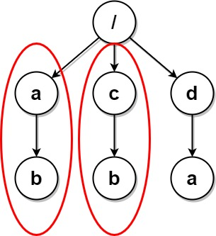
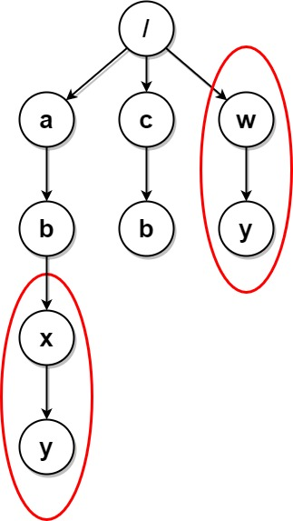
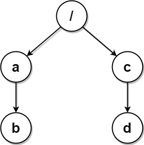

# Problem: Delete Duplicate Folders in System

## Problem Description
Due to a bug, there are many **duplicate folders** in a file system. You are given a 2D array `paths`, where `paths[i]` is an array representing an **absolute path** to the `i`th folder in the file system.

- For example, `['one', 'two', 'three']` represents the path `/one/two/three`.

**Two folders** (not necessarily on the same level) are **identical** if they contain the same non-empty set of identical subfolders and underlying subfolder structure. The folders do not need to be at the root level to be identical. If two or more folders are identical, then **mark the folders as well as all their subfolders**.

Once all the identical folders and their subfolders have been marked, the file system will **delete all of them**. The file system only runs the deletion once, so any folders that become identical after the initial deletion are **not deleted**.

Return the 2D array `ans` containing the **paths of the remaining folders** after deleting all the marked folders. The paths may be returned in any order.

## Input Format
- An integer 2D array `paths`, where each `paths[i]` is a list of strings representing an absolute path to a folder in the file system.

## Output Format
- A 2D array of strings, where each array represents the absolute path to a remaining folder after deletion.

## Examples

### Input

`paths = [["a"],["c"],["d"],["a","b"],["c","b"],["d","a"]]` 

### Output
`[["d"],["d","a"]]` 

Explanation: Folders "/a" and "/c" (and their subfolders) are marked for deletion because they both contain an empty folder named "b".

---

### Input

`paths = [["a"],["c"],["a","b"],["c","b"],["a","b","x"],["a","b","x","y"],["w"],["w","y"]]` 

### Output
`[["c"],["c","b"],["a"],["a","b"]]` 

Explanation: Folders "/a/b/x" and "/w" (and their subfolders) are marked for deletion because they both contain an empty folder named "y". Note that folders "/a" and "/c" are identical after the deletion, but they are not deleted because they were not marked beforehand.

---

### Input

`paths = [["a","b"],["c","d"],["c"],["a"]]` 

### Output
`[["c"],["c","d"],["a"],["a","b"]]` 

Explanation: All folders are unique in the file system. The returned array can be in any order.

## Constraints
- `1 <= paths.length <= 2 * 10^4`
- `1 <= paths[i].length <= 500`
- `1 <= paths[i][j].length <= 10`
- `1 <= sum(paths[i][j].length) <= 2 * 10^5`
- `paths[i][j]` consists of lowercase English letters.
- **No two paths lead to the same folder.**
- For any folder not at the root level, its parent folder will also be in the input.

