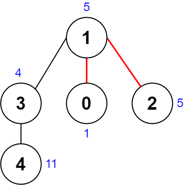
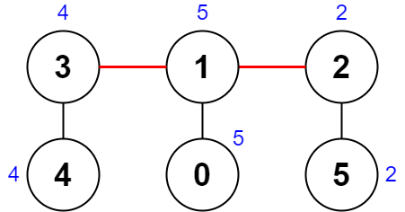

# Problem: Minimum Score After Removals on a Tree

## Problem Description
You are given an **undirected connected tree** with `n` nodes labeled from `0` to `n - 1` and `n - 1` edges. Each node `i` has a value given by `nums[i]`. The tree is described by the array `edges`, where each `edges[i] = [a_i, b_i]` indicates an edge between nodes `a_i` and `b_i`.

You need to **remove two distinct edges** from the tree, resulting in three connected components. For each pair of removed edges:
- Compute the **XOR** of all node values in each of the three components.
- The **score** is the difference between the largest and smallest XOR values among the three components.

**Return the minimum score** possible by removing any two edges.

## Input Format
- An integer array `nums` of length `n`, where `nums[i]` is the value of the `i`th node.
- A 2D integer array `edges` of length `n - 1`, where each `edges[i] = [a_i, b_i]` represents an edge between nodes `a_i` and `b_i`.

## Output Format
- An integer representing the **minimum score** achievable by removing any two edges.

## Examples

### Input

`nums = [1,5,5,4,11]`, `edges = [[0,1],[1,2],[1,3],[3,4]]` 

### Output
`9` 

### Input

`nums = [5,5,2,4,4,2]`, `edges = [[0,1],[1,2],[5,2],[4,3],[1,3]]` 

### Output
`0` 

## Constraints
- `n == nums.length`
- `3 <= n <= 1000`
- `1 <= nums[i] <= 10^8`
- `edges.length == n - 1`
- `edges[i].length == 2`
- `0 <= a_i, b_i < n`
- `a_i != b_i`
- `edges` represents a **valid tree**.

## Notes
- For each pair of removed edges, the three resulting components' XOR values are calculated independently.
- The **score** is the difference between the largest and smallest XOR values among the three components.
- The goal is to **minimize** this score over all possible pairs of edge removals.

