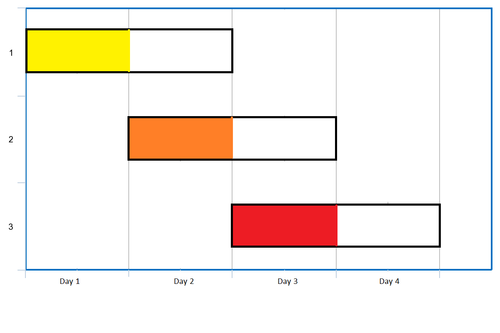

# Problem: Maximum Number of Events That Can Be Attended

## Problem Description
You are given an array of **events** where each `events[i] = [startDay_i, endDay_i]`. Every event `i` starts at `startDay_i` and ends at `endDay_i`. You can attend an event `i` on any day `d` such that `startDay_i <= d <= endDay_i`. **You can only attend one event at any given day.**

Return the **maximum number of events you can attend**.

## Input Format
- An array `events` of size `n`, where each element is a list of two integers: `[startDay_i, endDay_i]`.
- `1 <= events.length <= 10^5`
- `events[i].length == 2`
- `1 <= startDay_i <= endDay_i <= 10^5`

## Output Format
- A single integer representing the **maximum number of events you can attend**.

## Examples

### Input
`events = [[1,2],[2,3],[3,4]]` 

### Output
`3` 

**Explanation:** You can attend all three events. One way is:
- Attend the first event on day `1`.
- Attend the second event on day `2`.
- Attend the third event on day `3`.

### Input
`events = [[1,2],[2,3],[3,4],[1,2]]` 

### Output
`4` 

## Constraints
- `1 <= events.length <= 10^5`
- `events[i].length == 2`
- `1 <= startDay_i <= endDay_i <= 10^5`

## Notes
- Each event can only be attended once, and you cannot attend more than one event on the same day.

