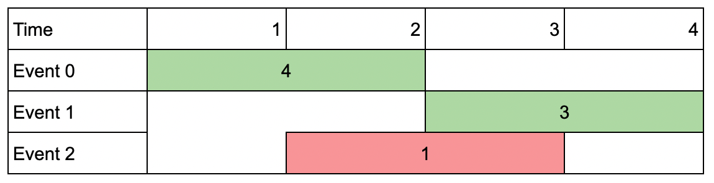
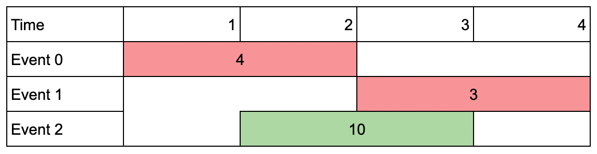
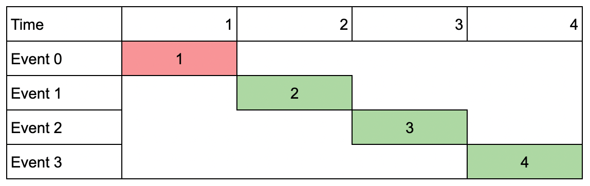

# Problem: Maximum Number of Events That Can Be Attended II

## Problem Description
You are given an array of `events` where each `events[i] = [startDay_i, endDay_i, value_i]`. The `i`-th event starts at `startDay_i` and ends at `endDay_i` (**inclusive**), and if you attend this event, you will receive a value of `value_i`. You are also given an integer `k` which represents the **maximum number of events you can attend**.

You can only attend **one event at a time**. If you choose to attend an event, you must attend the entire event. **You cannot attend two events where one starts on the same day another ends.**

Return the **maximum sum of values** that you can receive by attending events.

## Input Format
- An array `events` of size `n`, where each element is `[startDay, endDay, value]`.
- An integer `k` representing the maximum number of events you can attend.

## Output Format
- An integer representing the **maximum sum of values** you can receive by attending at most `k` non-overlapping events.

## Examples

### Input
`events = [[1,2,4],[3,4,3],[2,3,1]], k = 2` 

### Output
`7` 

**Explanation:** Choose the events at index 0 and 1 for a total value of `4 + 3 = 7`.

### Input

`events = [[1,2,4],[3,4,3],[2,3,10]], k = 2` 

### Output
`10` 

**Explanation:** Choose event at index 2 for a total value of `10`. You cannot attend any other event as they overlap.

### Input

`events = [[1,1,1],[2,2,2],[3,3,3],[4,4,4]], k = 3` 

### Output
`9` 

**Explanation:** Pick the highest valued three events: `1 + 3 + 4 = 9`.

## Constraints
- `1 <= k <= events.length`
- `1 <= k * events.length <= 10^6`
- `1 <= startDay_i <= endDay_i <= 10^9`
- `1 <= value_i <= 10^6`

