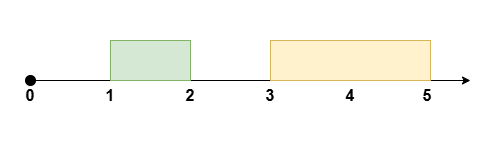
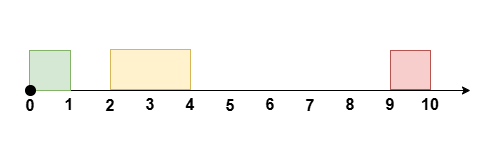

# Problem: Reschedule Meetings for Maximum Free Time I

## Problem Description
You are given an integer `eventTime` representing the duration of an event, where the event occurs from time `t = 0` to time `t = eventTime`.

You are also given two integer arrays `startTime` and `endTime`, each of length `n`. These represent the start and end times of **n non-overlapping meetings**, where the `i`th meeting occurs during the time `[startTime[i], endTime[i]]`.

You can **reschedule at most k meetings** by moving their start time (while maintaining the same duration), to **maximize the longest continuous period of free time** during the event.

- The **relative order** of all the meetings should stay the same and they should remain **non-overlapping**.
- Meetings cannot be rescheduled to a time outside the event.

Return the **maximum amount of free time possible** after rearranging the meetings.

## Input Format
- An integer `eventTime` — the duration of the event.
- An integer `k` — the maximum number of meetings you can reschedule.
- An integer array `startTime` of length `n` — the start times of the meetings.
- An integer array `endTime` of length `n` — the end times of the meetings.

## Output Format
- An integer — the **maximum amount of free time possible** after rearranging the meetings.

## Examples

### Input
`eventTime = 5, k = 1, startTime = [1, 3], endTime = [2, 5]` 

### Output
`2` 

**Explanation:**

Reschedule the meeting at `[1, 2]` to `[2, 3]`, leaving no meetings during the time `[0, 2]`.

### Input
`eventTime = 10, k = 1, startTime = [0, 2, 9], endTime = [1, 4, 10]` 

### Output
`6` 

**Explanation:**

Reschedule the meeting at `[2, 4]` to `[1, 3]`, leaving no meetings during the time `[3, 9]`.

### Input
`eventTime = 5, k = 2, startTime = [0, 1, 2, 3, 4], endTime = [1, 2, 3, 4, 5]` 

### Output
`0` 

**Explanation:**
There is no time during the event not occupied by meetings.

## Constraints
- `1 <= eventTime <= 10^9`
- `n == startTime.length == endTime.length`
- `2 <= n <= 10^5`
- `1 <= k <= n`
- `0 <= startTime[i] < endTime[i] <= eventTime`
- `endTime[i] <= startTime[i + 1]` for all `i` in `[0, n - 2]`

## Notes
- Meetings must remain non-overlapping and within the event time.
- The order of meetings cannot be changed.

